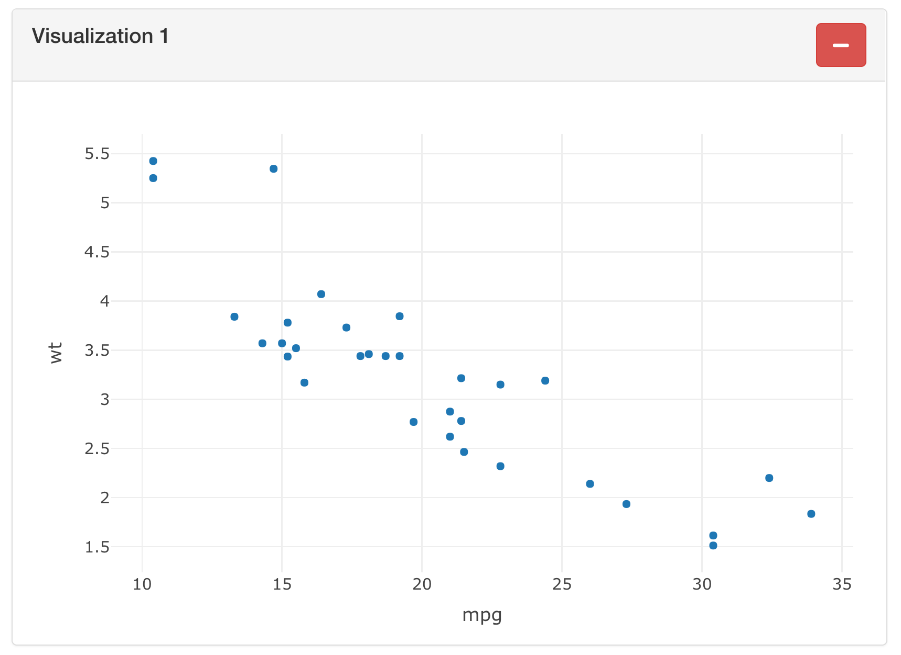

Part 1
================
Pascal Schmidt
03/07/2021

I participated in the R Shiny 2021 contest and published an application
similar to the Google Analytics dashboard. For that, I used the Google
Analytics API and the Goolgle Search Console API to pull my own data
from my blog directly in to the application.

The application uses the `shinyauthr` library because the dashboard can
be adjusted for each user who has their own user name and password. On
the first page, there are some visualizations for page views, devices
used, etc. On the second page there is a timeseries model that tries to
predict my page views for two months in advance.

I have been learning R Shiny seriously for a year now and tried to put
in as much knowledge as possible from my learning over the past year.
Some features of the app include:

-   JavaScript annd jQuery code + some CSS and Boostrap classes for
    better user experience
-   The Shiny router package from Appsilon to make the app appear like a
    multipage application.
-   A mongoDB database to save user data and individualize the
    dashboard.
-   Modularization of code to create a maintanable application that is
    easy to extend.
-   Custom functions for better unit testing.
-   R Shiny testing.
-   R Shiny application as a package for easier testing and better
    documentation.
-   A time series model with `modeltime`

This blog post series consists of multiple parts and we are coding the
application together from scratch. Let’s get started.

## Basic UI

The first part will be the hardest one. That is not to say that is is
hard, but I will be the hardest one for me becuase we are going to use
some JavaScript and jQuery which I am not very familiar with. I am a
data scientist and still learning how to implement some JS and jQuery in
my Shiny application to create a better unser experience and more
efficient applications.

When you are using the app, you can see that when we add a visualization
or remove a visualizatio, none of the existing visualizations are being
re-drawn. This is becuase I decided against the `renderUI` function
which would have re-created every single visualization after adding or
removing them.

Instead, we will be using JS and jQuery to remove and add HTML in the
browser without calling the Shiny server too often.

``` r
div(
  class = "class_a",
  div(
    class = "col-md-6",
    div(
      class = "panel panel-default",
      div(
        class = "panel-heading clearfix",
        tags$h2("Visualization 1", class = "pull-left panel-title"),
        div(
          class = "pull-right",
          shiny::actionButton(
            inputId = "a",
            label = "",
            class = "btn-danger delete",
            icon = shiny::icon("minus")
          )
        )
      ),
      div(
        class = "panel-body",
        plotly::plot_ly(mtcars, x = ~mpg, y = ~wt)
      )
    )
  )
)
```



The class in the first div results in removing the entire visualization
and the id inside the `actionButton` is the identifier which div should
be removed when clicked. Let’s code the logic for that so it will make
more sense.

## JavaScript + jQuery for Removing Visualizations

``` js
// remove plot and add action link
$(document).on("click", ".delete", function() {

  var clicked_id = $(this).attr('id');
  var header_h2 = $("#" + clicked_id).parent().parent().text().trim();
  $(".class_" + clicked_id).remove();

  var html = '<div class="added_' + clicked_id +
  '"><a id="' + clicked_id + '" href="#" class="action-button">' + header_h2 + '</a>'

  if ($( "[class^='added_']" ).length) {
        last_class_added = document.querySelectorAll("[class^='added_']");
        added_class = last_class_added[last_class_added.length - 1].className;
        $(html).insertAfter($("." + added_class));
    } else {
        last_class_added = document.querySelectorAll("[class^='class_']");
        added_class = last_class_added[last_class_added.length - 1].className;
        $(html).insertAfter($("." + added_class));
    }

})
```

When we click the delete button, we are going to get the clicked id from
the action button which has to be unique with `$(this).attr('id')`. In
the case above it would be `a`. We then grab the header of the
visualization, in this case it is `Visualization 1` with
`$("#" + clicked_id).parent().parent().text().trim()`. We then then get
the class inside the first div which is `class_a` and then remove the
entire div with `$(".class_" + clicked_id).remove()`. This removes the
entire visualization since it lies within that div.

When you look at the final dashboard, you realize that after deleting a
visualization, an action link appears in the sidebar. When the action
link is clicked, the visualization pops back into the dashboard. So, we
have to create the action link next.

``` r
shiny::actionLink(
  inputId = "a",
  label   = "Visualization 1"
)
```

The HTML looks like that:
`<a id="a" href="#" class="action-button">Visualization 1</a>`

However, we have to add a class to it and also a name in order to choose
the correct visualization when adding it back to the dashboard.

``` js
'<div class="added_' + clicked_id +
'"><a id="' + clicked_id + 
'" href="#" class="action-button">' + 
header_h2 + '</a>'
```

The action button link like this. We are creating an `added_a` class and
an id equal to `a` and add the `Visualization 1` header to it.

Afterwards, we have to specify where we would like to put the action
link. When there is no existing action link, we would like to put the
link after the first visualization and when there already exists a link,
all subsequent action links will be placed after the last action link on
the page with the code below.

``` js
if ($( "[class^='added_']" ).length) {
        last_class_added = document.querySelectorAll("[class^='added_']");
        added_class = last_class_added[last_class_added.length - 1].className;
        $(html).insertAfter($("." + added_class));
    } else {
        last_class_added = document.querySelectorAll("[class^='class_']");
        added_class = last_class_added[last_class_added.length - 1].className;
        $(html).insertAfter($("." + added_class));
    }
```

The code above basically says that when there is no action link, then
use the else statement and place it after the last visualization and if
there already exists one then place it after the last action link.

That was it for the first tutorial of how I created the application.
Please let me know if you have any questions in the comments below.
Thank for the read and look out for the second part!

## Final Version Part 1

``` r
library(shiny)
library(tidyverse)
library(plotly)

# Define UI for application that draws a histogram
ui <- fluidPage(

    br(),
    br(),

    shiny::tagList(

        # first viz
        div(
            class = "class_a",
            div(
                class = "col-md-6",
                div(
                    class = "panel panel-default",
                    div(
                        class = "panel-heading clearfix",
                        tags$h2("Visualization 1", class = "pull-left panel-title"),
                        div(
                            class = "pull-right",
                            shiny::actionButton(
                                inputId = "a",
                                label = "",
                                class = "btn-danger delete",
                                icon = shiny::icon("minus")
                            )
                        )
                    ),
                    div(
                        class = "panel-body",
                        plotly::plot_ly(mtcars, x = ~mpg, y = ~wt)
                    )
                )
            )
        ),

        # second viz
        div(
            class = "class_b",
            div(
                class = "col-md-6",
                div(
                    class = "panel panel-default",
                    div(
                        class = "panel-heading clearfix",
                        tags$h2("Visualization 2", class = "pull-left panel-title"),
                        div(
                            class = "pull-right",
                            shiny::actionButton(
                                inputId = "b",
                                label = "",
                                class = "btn-danger delete",
                                icon = shiny::icon("minus")
                            )
                        )
                    ),
                    div(
                        class = "panel-body",
                        plotly::plot_ly(mtcars, x = ~mpg, y = ~wt)
                    )
                )
            )
        ),

        # third viz
        div(
            class = "class_c",
            div(
                class = "col-md-6",
                div(
                    class = "panel panel-default",
                    div(
                        class = "panel-heading clearfix",
                        tags$h2("Visualization 3", class = "pull-left panel-title"),
                        div(
                            class = "pull-right",
                            shiny::actionButton(
                                inputId = "c",
                                label = "",
                                class = "btn-danger delete",
                                icon = shiny::icon("minus")
                            )
                        )
                    ),
                    div(
                        class = "panel-body",
                        plotly::plot_ly(mtcars, x = ~mpg, y = ~wt)
                    )
                )
            )
        )

    ),

    shiny::includeScript(here::here("GA_dashboard/part_1/www/scripts.js"))

)

# Define server logic required to draw a histogram
server <- function(input, output) {


}

# Run the application
shinyApp(ui = ui, server = server)
```
